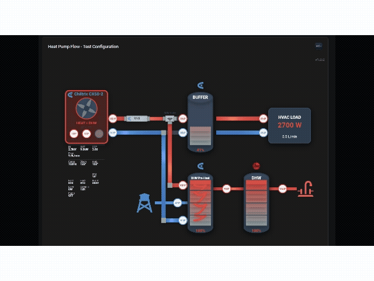

# Heat Pump Flow Card

A beautiful, animated Home Assistant card that visualizes heat pump water flow between the heat pump, buffer tank, DHW (Domestic Hot Water) tank, and HVAC load with real-time temperature-based color gradients, dynamic flow animations, and temperature status indicators at critical system points.


<!-- SCREENSHOT: Main visualization showing the complete heat pump system with buffer tank, DHW tank, HVAC load, and flowing animations. Capture during active heating mode with visible temperature indicators. -->

## Table of Contents

- [Features](#features)
- [Installation](#installation)
  - [HACS](#hacs-recommended)
  - [Manual Installation](#manual-installation)
  - [Updating the Card](#updating-the-card)
- [Configuration](#configuration)
  - [Basic Example](#basic-example)
  - [Full Configuration Example](#full-configuration-example)
- [Configuration Options](#configuration-options)
  - [Main Options](#main-options)
  - [Heat Pump Options](#heat-pump-options-heat_pump)
  - [Custom Metrics](#custom-metrics-metrics)
  - [Heat Pump Visual Options](#heat-pump-visual-options-heat_pump_visual)
  - [Buffer Tank Options](#buffer-tank-options-buffer_tank)
  - [DHW Tank Options](#dhw-tank-options-dhw_tank)
  - [DHW Heating Diverter Valve Options](#dhw-heating-diverter-valve-options-g2_valve)
  - [Auxiliary Heater Options](#auxiliary-heater-options-aux_heater)
  - [HVAC Options](#hvac-options-hvac)
  - [House Performance Options](#house-performance-options-house)
  - [Animation Options](#animation-options-animation)
  - [Temperature Options](#temperature-options-temperature)
  - [Temperature Status Indicators](#temperature-status-indicators-temperature_status)
  - [Text Style Options](#text-style-options-text_style)
  - [Display Options](#display-options-display)
  - [Labels](#labels-labels)
- [How It Works](#how-it-works)
- [Troubleshooting](#troubleshooting)
- [Support](#support)
- [Credits](#credits)
- [License](#license)

## Features

✨ **Animated Water Flow** - Dots move along pipes at speeds proportional to actual flow rates, with adaptive animation that hides when flow stops

🌡️ **Temperature-Based Colors** - Pipes change color from blue (cold) to red (hot) based on actual water temperature with configurable thresholds

📍 **Temperature Status Indicators** - Clean circular indicators show real-time temperatures at critical points (HP inlet/outlet, buffer supply/return, HVAC supply/return, DHW coil inlet/outlet, DHW tank inlet/outlet). Click any indicator to view Home Assistant history graphs.

🌀 **Animated Heat Pump** - Spinning fan that rotates based on actual fan speed (0-100%) with customizable brand logos and colors

🎨 **State-Based Coloring** - Heat pump changes color based on operating mode (heating=red, cooling=blue, DHW=orange, defrost=yellow, off=gray)

🔥 **Auxiliary Heater Visualization** - Inline electric heater with dynamic glow animations based on power consumption, configurable brand logos

🔀 **DHW Heating Diverter Valve** - Visual indicator showing flow direction (buffer tank or DHW tank mode)

🛢️ **Dual Tank Support** - Buffer tank and DHW (Domestic Hot Water) tank with gradient temperature visualization

📊 **Real-Time Data** - Shows thermal power, COP, temperatures, flow rates, energy consumption, costs, and runtime. All metrics are clickable to view history graphs.

📈 **Custom Metrics** - Add your own sensors with custom labels below the core metrics in the same 3-column grid format.

🌈 **Tank Gradient Visualization** - Tanks fill with color gradients representing temperature stratification from bottom to top

🏠 **House Performance Metrics** - Track heat loss, coefficients, Manual J calculations, and system efficiency

🎛️ **Dynamic Unit Display** - Automatically uses each sensor's actual unit of measurement (GPM, L/min, °F, °C, etc.)

⚙️ **Highly Configurable** - Customize colors, animation speeds, temperature ranges, display options, and labels for internationalization

🏠 **HACS Compatible** - Easy installation through Home Assistant Community Store

<!-- SCREENSHOT PLACEHOLDER: Features showcase - Consider adding a multi-panel image showing:
  - Panel 1: Temperature status indicators in action (circles on pipes with temperatures)
  - Panel 2: Different operating modes (heating=red, cooling=blue, DHW=orange)
  - Panel 3: Auxiliary heater with glow animation at different power levels
  - Panel 4: Tank gradient visualization showing temperature stratification
-->

## Installation

### HACS (Recommended)

#### Add as Custom Repository

1. Open HACS in your Home Assistant instance
2. Click on "Frontend"
3. Click the three dots menu (⋮) in the top right corner
4. Select "Custom repositories"
5. Add the repository URL: `https://github.com/jasipsw/heat-pump-flow-card`
6. Select category: "Lovelace"
7. Click "Add"
8. Click the "+" button in the bottom right
9. Search for "Heat Pump Flow Card"
10. Click "Install"
11. Restart Home Assistant

> **Note:** In the future, this card may be available in the HACS default repository, allowing you to skip steps 3-7 and search for it directly.

### Manual Installation

1. Download `heat-pump-flow-card.js` from the [latest release](https://github.com/jasipsw/heat-pump-flow-card/releases)
2. Copy it to your `config/www` folder
3. Add the resource to your Lovelace dashboard:

```yaml
resources:
  - url: /local/heat-pump-flow-card.js
    type: module
```

4. **(Optional)** To display the Heat Pump Flow Card logo in the card header:
   - Download `heat-pump-flow.png` from the repository
   - Copy it to your `config/www` folder
   - The logo will appear automatically in the top-right corner of the card
   - Configure with `show_logo`, `logo_path`, and `logo_size` options (see Configuration Options)

### Updating the Card

When you update to a new version, Home Assistant and your browser may cache the old code. For the most reliable updates:

**Quick Method**: Add a version parameter to your resource URL:
```yaml
resources:
  - url: /hacsfiles/heat-pump-flow-card/heat-pump-flow-card.js?v=0.28.0
    type: module
```

When updating, just increment the version number (`?v=0.28.1`) and restart HA.

**Complete Guide**: See [CACHE_BUSTING.md](CACHE_BUSTING.md) for detailed instructions on clearing all caches.

**Verify Version**: Press F12 in your browser, check the Console tab for:
```
HEAT-PUMP-FLOW-CARD
Version X.X.X
Built: [timestamp]
```

The build timestamp confirms you have the latest code.

## Configuration

### Basic Example

```yaml
type: custom:heat-pump-flow-card
title: Heat Pump System
heat_pump:
  power_entity: sensor.heat_pump_electrical_power_input
  thermal_entity: sensor.heat_pump_thermal_power_output
  cop_entity: sensor.heat_pump_cop
  outlet_temp_entity: sensor.heat_pump_outlet_temperature
  inlet_temp_entity: sensor.heat_pump_inlet_temperature
  flow_rate_entity: sensor.cx50_pump_flow_lpm
  display_name: "CX50-2"
  logo_url: "/local/chiltrix_logo.png"
buffer_tank:
  supply_temp_entity: sensor.hvac_buffer_tank_supply_temperature
  return_temp_entity: sensor.hvac_buffer_tank_return_temperature
  gradient:
    enabled: true
    min_temp: sensor.indoor_temperature
    max_temp: sensor.heating_setpoint
hvac:
  thermal_entity: sensor.hvac_thermal_power_used
  flow_rate_entity: sensor.hydronic_flow_flow_rate
  supply_temp_entity: sensor.hvac_buffer_tank_supply_temperature
  return_temp_entity: sensor.hvac_buffer_tank_return_temperature
temperature_status:
  enabled: true
  circle_radius: 12
```

<!-- SCREENSHOT PLACEHOLDER: Basic configuration example result - Show the card rendering with the basic configuration above. This gives users a preview of what they'll get with minimal setup. -->

### Full Configuration Example

```yaml
type: custom:heat-pump-flow-card
title: Heat Pump Flow Visualization

heat_pump:
  power_entity: sensor.heat_pump_electrical_power_input
  thermal_entity: sensor.heat_pump_thermal_power_output
  cop_entity: sensor.heat_pump_cop
  outlet_temp_entity: sensor.heat_pump_outlet_temperature
  inlet_temp_entity: sensor.heat_pump_inlet_temperature
  flow_rate_entity: sensor.cx50_pump_flow_lpm
  fan_speed_entity: sensor.heat_pump_fan_speed
  mode_entity: sensor.heat_pump_mode
  mode_display_entity: sensor.heat_pump_mode_display
  defrost_entity: binary_sensor.heat_pump_defrost
  error_entity: sensor.heat_pump_error
  energy_entity: sensor.heat_pump_energy_total
  cost_entity: sensor.heat_pump_cost
  runtime_entity: sensor.heat_pump_runtime
  display_name: "Chiltrix CX50-2"
  logo_url: "/local/chiltrix_logo.png"
  logo_background_color: "white"
  logo_text_color: "#2c3e50"

heat_pump_visual:
  off_color: "#95a5a6"
  heating_color: "#e74c3c"
  cooling_color: "#3498db"
  dhw_color: "#e67e22"
  defrost_color: "#f1c40f"
  show_metrics: true
  animate_fan: true

# Custom metrics - add your own sensors below the core metrics
metrics:
  - entity: sensor.heat_pump_oil_temp
    label: "Oil T"
    unit: "°C"
    decimals: 1
  - entity: sensor.heat_pump_pressure
    label: "Press"
    unit: "PSI"
    decimals: 0
  - entity: sensor.heat_pump_custom_3
    label: "Cust3"

buffer_tank:
  supply_temp_entity: sensor.hvac_buffer_tank_supply_temperature
  return_temp_entity: sensor.hvac_buffer_tank_return_temperature
  name: "BUFFER TANK"                        # Custom tank label
  logo_url: "/local/chiltrix-logo.png"       # Brand logo next to label
  label_color: "#ffffff"                     # White label text
  label_font_size: 12                        # Font size in pixels
  gradient:
    enabled: true
    levels: 10
    min_temp: sensor.indoor_temperature       # Can use entity
    max_temp: sensor.heating_setpoint          # Can use entity
    bottom_color: "#95a5a6"
    heating_top_color: "#e74c3c"
    cooling_top_color: "#3498db"

dhw_tank:
  inlet_temp_entity: sensor.dhw_inlet_temperature         # DHW coil inlet (hot from HP)
  outlet_temp_entity: sensor.dhw_outlet_temperature       # DHW coil outlet (return to HP)
  tank_temp_entity: sensor.dhw_tank_temperature           # Tank water temperature
  tank_inlet_flow_entity: sensor.street_water_flow        # Street water flow rate (optional)
  tank_inlet_temp_entity: sensor.street_water_temp        # Street water temperature
  tank_inlet_color: "#3498db"                             # Cold inlet color (default: light blue)
  tank_inlet_icon_url: "mdi:water-pump"                   # Water source icon (MDI icon or image URL)
  tank_outlet_temp_entity: sensor.dhw_hot_outlet_temp     # Hot water outlet temperature
  tank_outlet_color: "#e74c3c"                            # Hot outlet color (default: red)
  tank_outlet_icon_url: "mdi:faucet-variant"              # Hot water outlet icon (when tank 2 disabled)
  name: "HOT WATER"                                       # Custom tank label
  logo_url: "/local/chiltrix-logo.png"                    # Brand logo next to label
  label_color: "#ffffff"                                  # White label text
  label_font_size: 12                                     # Font size in pixels
  gradient:
    enabled: true
    levels: 10
    min_temp: 60                                          # Can use hard-coded number
    max_temp: sensor.dhw_setpoint                         # Or mix both approaches
    bottom_color: "#95a5a6"
    top_color: "#e74c3c"

g2_valve:
  state_entity: binary_sensor.g2_valve_dhw_mode

aux_heater:
  enabled: true
  power_entity: sensor.aux_heater_power
  max_power: 18000
  display_name: "V18"
  show_label: true
  logo_url: "/local/v18_logo.png"
  label_color: "#2c3e50"
  glow_size: 8
  shadow_blur: 1.0

hvac:
  thermal_entity: sensor.hvac_thermal_power_used
  flow_rate_entity: sensor.hydronic_flow_flow_rate
  supply_temp_entity: sensor.hvac_supply_temperature
  return_temp_entity: sensor.hvac_return_temperature

house:
  heat_loss_kw_entity: sensor.house_heat_loss_kw
  heat_loss_btu_h_entity: sensor.house_heat_loss_btu_h
  projected_max_heat_loss_kw_entity: sensor.manual_j_max_heat_loss_kw
  heat_loss_coefficient_kw_c_entity: sensor.heat_loss_coefficient
  indoor_temp_entity: sensor.average_indoor_temperature
  outdoor_temp_entity: sensor.outdoor_temperature
  delta_t_24h_mean_entity: sensor.delta_t_24h_mean

animation:
  enabled: true
  min_flow_rate: 5
  max_flow_rate: 1
  max_flow_rate_value: 50
  idle_threshold: 0
  dot_size: 1.5
  use_temp_color: false
  dot_color: "rgba(255, 255, 255, 0.75)"
  dot_opacity: 1.0

temperature:
  delta_threshold: 10
  hot_color: "#e74c3c"
  cold_color: "#3498db"
  neutral_color: "#95a5a6"
  unit: "C"

temperature_status:
  enabled: true
  circle_radius: 12
  points:
    hp_outlet:
      enabled: true
    hp_inlet:
      enabled: true
    buffer_supply:
      enabled: true
    buffer_return:
      enabled: true
    hvac_supply:
      enabled: true
    hvac_return:
      enabled: true
    dhw_inlet:
      enabled: true
    dhw_outlet:
      enabled: true

text_style:
  font_family: "Courier New, monospace"
  font_size: 11
  font_weight: "bold"
  show_labels: false

display:
  show_values: true
  show_labels: true
  show_icons: true
  compact: false
  decimal_places: 1

labels:
  hp_supply: "HP Supply"
  hp_return: "HP Return"
  hvac_supply: "HVAC Supply"
  hvac_return: "HVAC Return"
  buffer_tank: "BUFFER"
  dhw_tank: "DHW"
  power_in: "Power In"
  thermal_out: "Thermal Out"
  cop: "COP"
  flow: "Flow"
  energy: "Energy"
  cost: "Cost"
```

## Configuration Options

### Main Options

| Name | Type | Default | Description |
|------|------|---------|-------------|
| `type` | string | **Required** | Must be `custom:heat-pump-flow-card` |
| `title` | string | Optional | Card title |
| `show_logo` | boolean | `true` | Show Heat Pump Flow Card logo in header (clickable) |
| `logo_path` | string | `/local/heat-pump-flow.png` | Path to logo image (requires copying `heat-pump-flow.png` to `config/www/` folder) |
| `logo_url` | string | `GitHub README` | URL to open when clicking the logo (opens in new tab) |
| `logo_size` | number | `40` | Logo height in pixels |

### Heat Pump Options (`heat_pump`)

| Name | Type | Description |
|------|------|-------------|
| `power_entity` | string | Electrical power input sensor (W) |
| `thermal_entity` | string | Thermal power output sensor (W) |
| `cop_entity` | string | COP (Coefficient of Performance) sensor |
| `outlet_temp_entity` | string | Heat pump outlet temperature sensor |
| `inlet_temp_entity` | string | Heat pump inlet (return) temperature sensor |
| `flow_rate_entity` | string | Water flow rate sensor (L/min, GPM, etc.) |
| `fan_speed_entity` | string | Fan speed sensor (0-100%) - controls animation speed |
| `mode_entity` | string | Operating mode sensor (heating/cooling/dhw/idle/off) |
| `mode_display_entity` | string | Mode display text entity (e.g., "Heat+DHW", "Heating Only") |
| `defrost_entity` | string | Defrost mode binary sensor (on/off) |
| `error_entity` | string | Error/alarm sensor |
| `energy_entity` | string | Total energy consumed (kWh) |
| `cost_entity` | string | Energy cost |
| `runtime_entity` | string | Runtime tracking sensor (seconds) |
| `display_name` | string | Display name (e.g., "Chiltrix CX50-2") |
| `logo_url` | string | URL to logo image (local /local/... or external https://...) |
| `logo_background_color` | string | Background color for logo area (default: transparent, e.g., "white", "#ffffff") |
| `logo_text_color` | string | Text color for brand name (default: dynamic based on HP state) |

#### Temperature Setpoint Entities

| Name | Type | Description |
|------|------|-------------|
| `heating_target_temp_entity` | string | Heating target temperature setpoint |
| `dhw_target_temp_entity` | string | DHW target temperature setpoint |
| `cooling_target_temp_entity` | string | Cooling target temperature setpoint |

#### Electrical Metrics

| Name | Type | Description |
|------|------|-------------|
| `amps_entity` | string | Current draw (amps) |
| `volts_entity` | string | Voltage (volts) |

#### Detailed Metrics Panel

Enable a detailed metrics panel below the heat pump showing compressor frequency, temperatures, fan speeds, and more. **All metrics are clickable** - click any metric to view its history graph in Home Assistant.

| Name | Type | Description |
|------|------|-------------|
| `show_detailed_metrics` | boolean | Enable detailed metrics panel (default: false) |
| `compressor_frequency_entity` | string | Compressor frequency (Hz) |
| `discharge_temp_entity` | string | Compressor discharge temperature |
| `ambient_temp_entity` | string | Ambient air temperature |
| `dhw_temp_entity` | string | DHW temperature |
| `outdoor_coil_temp_entity` | string | Outdoor coil temperature |
| `suction_temp_entity` | string | Suction line temperature |
| `heat_exchanger_temp_entity` | string | Heat exchanger temperature |
| `plate_exchange_temp_entity` | string | Plate heat exchanger temperature |
| `ec_fan_motor_1_speed_entity` | string | EC fan motor 1 speed |
| `ec_fan_motor_2_speed_entity` | string | EC fan motor 2 speed |
| `bus_line_voltage_entity` | string | Bus line voltage (V) |
| `fan_shutdown_code_entity` | string | Fan shutdown code |
| `ipm_temp_entity` | string | IPM temperature |
| `compressor_running_time_entity` | string | Compressor total running time |
| `e_heater_power_entity` | string | E-heater compensation power |
| `din6_mode_switch_entity` | string | DIN6 AC/heating mode switch |
| `din7_mode_switch_entity` | string | DIN7 AC/heating mode switch |
| `pump_enabled_entity` | string | Pump enabled status |
| `compressor_max_percentage_entity` | string | Compressor max percentage |
| `defrost_entity` | string | Defrost status (shown in detailed metrics when active) |
| `error_entity` | string | Error status (shown in detailed metrics when present) |

**Example:**
```yaml
heat_pump:
  # Basic required entities
  power_entity: sensor.heat_pump_power
  thermal_entity: sensor.heat_pump_thermal
  cop_entity: sensor.heat_pump_cop
  # ... other basic entities ...

  # Enable detailed metrics panel
  show_detailed_metrics: true

  # Detailed metrics entities
  compressor_frequency_entity: sensor.cx50_compressor_frequency
  discharge_temp_entity: sensor.cx50_discharge_temp
  ambient_temp_entity: sensor.cx50_ambient_temp
  suction_temp_entity: sensor.cx50_suction_temp
  plate_exchange_temp_entity: sensor.cx50_plate_exchange_temp
  ec_fan_motor_1_speed_entity: sensor.cx50_c45_ec_fan_motor_1_speed
  ec_fan_motor_2_speed_entity: sensor.cx50_c46_ec_fan_motor_2_speed
  bus_line_voltage_entity: sensor.cx50_bus_line_voltage
  ipm_temp_entity: sensor.cx50_c60_ipm_temp
  compressor_running_time_entity: sensor.cx50_c61_compressor_total_running_time
  e_heater_power_entity: sensor.cx50_c62_e_heater_compensation_power
  pump_enabled_entity: binary_sensor.cx_pump_enabled
  compressor_max_percentage_entity: number.cx50_compressor_max_percentage
  defrost_entity: binary_sensor.cx_defrost_active
  error_entity: sensor.cx50_error_status
```

**Detailed Metrics Display Order:**

The metrics panel displays data in a 3-column grid layout below the heat pump. All metrics are clickable to view history graphs.

**Core Metrics (Always Shown):**
- **Row 1:** IN (Power Input) | OUT (Thermal Output) | COP
- **Row 2:** Flow (Flow Rate) | Amps (Current) | Volts (Voltage)

**Detailed Metrics (When `show_detailed_metrics: true`):**
- **Row 3:** Comp (Compressor Frequency) | Disch (Discharge Temp) | Amb (Ambient Temp)
- **Row 4:** DHW (DHW Temp) | O-Coil (Outdoor Coil Temp) | Suct (Suction Temp)
- **Row 5:** HX (Heat Exchanger Temp) | Plate (Plate Exchange Temp) | IPM (IPM Temp)
- **Row 6:** Fan1 (EC Fan Motor 1) | Fan2 (EC Fan Motor 2) | Bus V (Bus Line Voltage)
- **Row 7:** E-Htr (E-Heater Power) | Comp H (Compressor Hours) | MaxC% (Max Compressor %)
- **Row 8:** Pump (Pump Status) | F-Code (Fan Shutdown Code*) | DIN6 (DIN6 Mode Switch)
- **Row 9:** Defrost (Defrost Status) | Error (Error Status*) | —

*Only shown when active/non-zero

### Custom Metrics (`metrics`)

Add your own custom sensors to be displayed below the core and detailed metrics in the same 3-column grid format. This is perfect for heat pump configurations with additional sensors that aren't covered by the standard entities.

**Configuration:**

Each metric in the array requires:
- `entity` (string, **required**): Sensor entity ID to display
- `label` (string, **required**): Custom abbreviation/label (keep short, e.g., "Cust1", "TempA", "P1")
- `unit` (string, optional): Unit override (default: uses entity's unit_of_measurement)
- `decimals` (number, optional): Decimal places to display (default: 1)

**Example:**
```yaml
metrics:
  - entity: sensor.heat_pump_custom_sensor_1
    label: "Custom1"
    unit: "°C"
    decimals: 1
  - entity: sensor.heat_pump_custom_sensor_2
    label: "Press"
    unit: "PSI"
    decimals: 0
  - entity: sensor.heat_pump_oil_temp
    label: "Oil T"
    # unit and decimals will use entity's defaults
  - entity: sensor.heat_pump_custom_sensor_4
    label: "Cust4"
  - entity: sensor.heat_pump_custom_sensor_5
    label: "Cust5"
  - entity: sensor.heat_pump_custom_sensor_6
    label: "Cust6"
```

**Display:**

Custom metrics are displayed in a 3-column grid below all core and detailed metrics:
- Automatically arranged into rows of 3 columns
- Uses the same format as core metrics (label on top, value below)
- All metrics are clickable to view history graphs
- Only displays if the entity has a valid value

**Tips:**
- Keep labels short (6 characters or less) for best appearance
- Labels are displayed at the top of each metric, so abbreviations work best
- Use the `unit` parameter to override long default units (e.g., "kW" instead of "kilowatts")
- Custom metrics appear below core metrics (or below detailed metrics if `show_detailed_metrics: true`)

### Heat Pump Visual Options (`heat_pump_visual`)

Configure the appearance and behavior of the animated heat pump visualization.

| Name | Type | Default | Description |
|------|------|---------|-------------|
| `off_color` | string | #95a5a6 | Color when heat pump is powered off (gray) |
| `heating_color` | string | #e74c3c | Color when in heating mode (red) |
| `cooling_color` | string | #3498db | Color when in cooling mode (blue) |
| `dhw_color` | string | #e67e22 | Color when in DHW/hot water mode (orange) |
| `defrost_color` | string | #f1c40f | Color when defrosting (yellow) - highest priority |
| `show_metrics` | boolean | true | Show detailed metrics below heat pump |
| `animate_fan` | boolean | true | Enable fan rotation animation |

**Example:**
```yaml
heat_pump_visual:
  heating_color: '#FF0000'      # Bright red when heating
  cooling_color: '#0000FF'      # Bright blue when cooling
  defrost_color: '#FFA500'      # Orange when defrosting
  show_metrics: true            # Display power, COP, temps, etc.
  animate_fan: true             # Spin the fan based on fan_speed_entity
```

<!-- SCREENSHOT PLACEHOLDER: Heat Pump Visual Modes - Show heat pump appearance:
  - Animated spinning fan (capture motion if possible, or show fan at different speeds)
  - Different color states (heating=red, cooling=blue, DHW=orange, defrost=yellow, off=gray)
  - Brand logo display if configured (e.g., Chiltrix logo with background color)
  - Metrics display below heat pump (power, COP, temperatures, flow rate)
-->

### Buffer Tank Options (`buffer_tank`)

| Name | Type | Default | Description |
|------|------|---------|-------------|
| `supply_temp_entity` | string | - | Buffer tank supply (hot) temperature |
| `return_temp_entity` | string | - | Buffer tank return (cold) temperature |
| `level_entity` | string | - | Tank level sensor (optional) |
| `name` | string | BUFFER | Tank display name/label |
| `logo_url` | string | - | Logo URL displayed left of label |
| `label_color` | string | white | Tank label text color |
| `label_font_size` | number | 12 | Tank label font size in pixels |
| `gradient` | object | - | Gradient visualization configuration (see below) |

**Gradient Configuration (`gradient`):**

| Name | Type | Default | Description |
|------|------|---------|-------------|
| `enabled` | boolean | true | Enable gradient visualization |
| `levels` | number | 10 | Number of gradient steps |
| `min_temp` | number or string | 60 | Min temp for gradient: hard-coded number (e.g., `60`) or entity (e.g., `sensor.indoor_temp`) |
| `max_temp` | number or string | 130 | Max temp for gradient: hard-coded number (e.g., `130`) or entity (e.g., `sensor.heating_setpoint`) |
| `min_temp_entity` | string | - | **DEPRECATED** - Use `min_temp` with entity string instead |
| `max_temp_entity` | string | - | **DEPRECATED** - Use `max_temp` with entity string instead |
| `min_temp_fallback` | number | 60 | **DEPRECATED** - Use `min_temp` with number instead |
| `max_temp_fallback` | number | 130 | **DEPRECATED** - Use `max_temp` with number instead |
| `bottom_color` | string | neutral_color | Bottom color (coldest) |
| `heating_top_color` | string | hot_color | Top color for heating mode (hottest) |
| `cooling_top_color` | string | cold_color | Top color for cooling mode |

<!-- SCREENSHOT PLACEHOLDER: Tank Gradient Visualization - Close-up of buffer and DHW tanks:
  - Show temperature gradient from bottom (cold/blue) to top (hot/red)
  - Display the gradient levels configuration effect (default 10 levels)
  - Show supply and return temperature indicators
  - Demonstrate different gradient states (heating vs cooling mode for buffer tank)
  - Include tank labels (BUFFER TANK, DHW)
-->

### DHW Tank Options (`dhw_tank`)

Domestic Hot Water tank with heating coil visualization.

| Name | Type | Default | Description |
|------|------|---------|-------------|
| `inlet_temp_entity` | string | - | DHW coil inlet temperature (hot from HP) |
| `outlet_temp_entity` | string | - | DHW coil outlet temperature (return to HP) |
| `tank_temp_entity` | string | - | DHW tank temperature (optional) |
| `name` | string | DHW | Tank display name/label |
| `logo_url` | string | - | Logo URL displayed left of label |
| `label_color` | string | white | Tank label text color |
| `label_font_size` | number | 12 | Tank label font size in pixels |
| `tank_inlet_flow_entity` | string | - | Street water flow rate (L/min) - optional, no animation if not provided |
| `tank_inlet_temp_entity` | string | - | Street water temperature |
| `tank_inlet_color` | string | #3498db | Street water pipe color (light blue for cold) |
| `tank_inlet_icon_url` | string | mdi:water-pump | Icon for water source (supports MDI icons like `mdi:water-pump` or image URLs) |
| `tank_outlet_temp_entity` | string | - | Hot water outlet temperature (to house or tank 2) |
| `tank_outlet_color` | string | #e74c3c | Hot water outlet pipe color (red for hot) |
| `tank_outlet_icon_url` | string | mdi:faucet-variant | Hot water outlet icon (supports MDI icons like `mdi:faucet-variant` or image URLs, shown when tank 2 is disabled) |
| `gradient` | object | - | Gradient visualization configuration |

> **Icon Support:** The `tank_inlet_icon_url` and `tank_outlet_icon_url` properties support both:
> - **MDI Icons**: Use Home Assistant's Material Design Icons (e.g., `mdi:faucet-variant`, `mdi:water-pump`, `mdi:water-well`)
> - **Image URLs**: Use local or remote image files (e.g., `/local/custom-faucet.png`, `https://...`)

**Gradient Configuration:**

| Name | Type | Default | Description |
|------|------|---------|-------------|
| `enabled` | boolean | true | Enable gradient visualization |
| `levels` | number | 10 | Number of gradient steps |
| `min_temp` | number or string | 60 | Min temp for gradient: hard-coded number (e.g., `60`) or entity (e.g., `sensor.street_water_temp`) |
| `max_temp` | number or string | 130 | Max temp for gradient: hard-coded number (e.g., `130`) or entity (e.g., `sensor.dhw_setpoint`) |
| `min_temp_entity` | string | - | **DEPRECATED** - Use `min_temp` with entity string instead |
| `max_temp_entity` | string | - | **DEPRECATED** - Use `max_temp` with entity string instead |
| `min_temp_fallback` | number | 60 | **DEPRECATED** - Use `min_temp` with number instead |
| `max_temp_fallback` | number | 130 | **DEPRECATED** - Use `max_temp` with number instead |
| `bottom_color` | string | neutral_color | Bottom color |
| `top_color` | string | hot_color | Top color |

### DHW Tank 2 Options (`dhw_tank_2`)

**Optional** second DHW tank for pre-heat/finishing heater configurations. When enabled, the first tank (`dhw_tank`) acts as a pre-heat tank using excess heat from the heat pump, and the second tank (`dhw_tank_2`) brings the water up to final temperature using conventional heating (electric/gas).

| Name | Type | Default | Description |
|------|------|---------|-------------|
| `enabled` | boolean | false | Enable second DHW tank |
| `inlet_temp_entity` | string | - | Inlet temperature (from first tank outlet) |
| `outlet_temp_entity` | string | - | Final outlet temperature (to house) |
| `tank_temp_entity` | string | - | Tank temperature (optional) |
| `name` | string | DHW 2 | Tank display name/label |
| `logo_url` | string | - | Logo URL displayed left of label |
| `label_color` | string | white | Tank label text color |
| `label_font_size` | number | 12 | Tank label font size in pixels |
| `tank_outlet_icon_url` | string | mdi:faucet-variant | Final outlet icon (supports MDI icons or image URLs) |
| `tank_outlet_color` | string | #e74c3c | Final outlet pipe color (red for hot) |
| `gradient` | object | - | Gradient visualization configuration (same as dhw_tank) |

> **Icon Support:** The `tank_outlet_icon_url` property supports both MDI icons (e.g., `mdi:faucet-variant`) and image URLs (e.g., `/local/custom-faucet.png`).

**Gradient Configuration:** Same options as `dhw_tank` gradient configuration above.

**Example Configuration:**

```yaml
dhw_tank:
  inlet_temp_entity: sensor.dhw_preheat_inlet_temp
  outlet_temp_entity: sensor.dhw_preheat_outlet_temp
  tank_temp_entity: sensor.dhw_preheat_tank_temp
  name: "PRE-HEAT"
  tank_inlet_temp_entity: sensor.street_water_temp
  tank_outlet_temp_entity: sensor.preheat_to_main_temp

dhw_tank_2:
  enabled: true
  inlet_temp_entity: sensor.main_dhw_inlet_temp
  outlet_temp_entity: sensor.main_dhw_outlet_temp
  tank_temp_entity: sensor.main_dhw_tank_temp
  name: "MAIN DHW"
  logo_url: "/local/rheem-logo.png"
  tank_outlet_icon_url: "mdi:faucet-variant"  # MDI icon or custom image URL
```

### DHW Heating Diverter Valve Options (`g2_valve`)

3-way diverter valve that directs flow between buffer tank (heating mode) and DHW tank (DHW mode).

| Name | Type | Description |
|------|------|-------------|
| `state_entity` | string | Entity indicating valve state (on=DHW mode, off=heating mode) |

### Auxiliary Heater Options (`aux_heater`)

Inline electric heater between heat pump and DHW heating diverter valve.

| Name | Type | Default | Description |
|------|------|---------|-------------|
| `enabled` | boolean | false | Show auxiliary heater visualization |
| `power_entity` | string | - | Power consumption entity (W) |
| `max_power` | number | 18000 | Maximum power for normalization (18kW) |
| `display_name` | string | "AUX" | Display name shown on visualization (e.g., "V18") |
| `show_label` | boolean | true | Show label above heater (default: true when display_name is set) |
| `logo_url` | string | - | URL to brand logo image |
| `logo_background_color` | string | transparent | Background color for logo |
| `label_color` | string | #2c3e50 | Text color for label |
| `glow_size` | number | 8 | Glow animation extension in pixels (larger = more dramatic) |
| `shadow_blur` | number | 1.0 | Drop-shadow blur intensity multiplier (2.0 = double blur) |

<!-- SCREENSHOT PLACEHOLDER: Auxiliary Heater - Show the heater in action:
  - Capture at different power levels (idle/low/medium/high power)
  - Show the dynamic glow animation effect when active
  - Display the brand logo if configured (e.g., "V18" label)
  - Demonstrate the visual intensity change based on power consumption
  - Consider a before/after or side-by-side comparison
-->

### HVAC Options (`hvac`)

Heating/cooling load (e.g., radiant floor, radiators, fan coils).

| Name | Type | Description |
|------|------|-------------|
| `thermal_entity` | string | Thermal power consumed by HVAC (W) |
| `flow_rate_entity` | string | HVAC flow rate sensor (L/min, GPM, etc.) |
| `supply_temp_entity` | string | HVAC supply temperature |
| `return_temp_entity` | string | HVAC return temperature |

### House Performance Options (`house`)

Building performance metrics for system efficiency tracking.

| Name | Type | Description |
|------|------|-------------|
| `heat_loss_kw_entity` | string | Real-time heat loss (kW) |
| `heat_loss_btu_h_entity` | string | Real-time heat loss (BTU/h) |
| `projected_max_heat_loss_kw_entity` | string | Manual J projected max (kW) |
| `projected_max_heat_loss_btu_h_entity` | string | Manual J projected max (BTU/h) |
| `heat_loss_coefficient_kw_c_entity` | string | Calculated coefficient (kW/°C) |
| `heat_loss_coefficient_energy_entity` | string | Energy-based coefficient |
| `indoor_temp_entity` | string | Average indoor temperature |
| `outdoor_temp_entity` | string | Outdoor temperature |
| `delta_t_raw_entity` | string | Raw delta-T (indoor - outdoor) |
| `delta_t_24h_mean_entity` | string | 24-hour mean delta-T |
| `thermal_energy_used_daily_entity` | string | Daily HVAC energy used |
| `thermal_energy_produced_daily_entity` | string | Daily HP energy produced |

### Animation Options (`animation`)

| Name | Type | Default | Description |
|------|------|---------|-------------|
| `enabled` | boolean | true | Enable/disable all animations |
| `min_flow_rate` | number | 5 | SLOW animation duration (seconds at low flow) |
| `max_flow_rate` | number | 1 | FAST animation duration (seconds at high flow) |
| `max_flow_rate_value` | number | 50 | Flow rate (L/min) that triggers fastest animation |
| `idle_threshold` | number | 0 | Flow rate (L/min) below which animations hide |
| `dot_size` | number | 1.5 | Size of animated particles in pixels (radius) |
| `use_temp_color` | boolean | false | Use temperature-based coloring for dots |
| `dot_color` | string | rgba(255,255,255,0.75) | Fixed dot color (white) |
| `dot_opacity` | number | 1.0 | Dot opacity 0-1 |

### Temperature Options (`temperature`)

Delta-based pipe coloring system.

| Name | Type | Default | Description |
|------|------|---------|-------------|
| `delta_threshold` | number | 10 | Minimum temp difference to show hot/cold colors |
| `hot_color` | string | #e74c3c | Color for hotter pipe (red) |
| `cold_color` | string | #3498db | Color for cooler pipe (blue) |
| `neutral_color` | string | #95a5a6 | Color when delta < threshold or no flow (gray) |
| `unit` | string | C | Temperature unit (C or F) - **Note:** Units are now automatically detected from sensors |

### Temperature Status Indicators (`temperature_status`)

**NEW:** Circular temperature indicators at critical system points. Click any indicator to view the sensor's history graph in Home Assistant.

| Name | Type | Default | Description |
|------|------|---------|-------------|
| `enabled` | boolean | false | Enable temperature status indicators |
| `circle_radius` | number | 12 | Radius of status circles in pixels |
| `points` | object | - | Individual point configuration (see below) |

**Points Configuration:**

Each point can be individually enabled/disabled and optionally override the temperature entity:

```yaml
temperature_status:
  enabled: true
  circle_radius: 12
  points:
    hp_outlet:
      enabled: true  # Show indicator at heat pump outlet
      entity: sensor.custom_hp_outlet_temp  # Optional: override entity
    hp_inlet:
      enabled: true  # Show indicator at heat pump inlet
    buffer_supply:
      enabled: true  # Show indicator at buffer supply
    buffer_return:
      enabled: true  # Show indicator at buffer return
    hvac_supply:
      enabled: true  # Show indicator at HVAC supply
    hvac_return:
      enabled: true  # Show indicator at HVAC return
    dhw_inlet:
      enabled: true  # Show indicator at DHW coil inlet (hot from HP)
    dhw_outlet:
      enabled: true  # Show indicator at DHW coil outlet (return to HP)
    dhw_tank_inlet:
      enabled: true  # Show indicator at DHW tank cold inlet (street water)
    dhw_tank_outlet:
      enabled: true  # Show indicator at DHW tank hot outlet (to house)
```

**Features:**
- Circle border color matches the pipe color it's on (red/blue/gray)
- White background with temperature value displayed
- Condensed font fits 4-digit temperatures (e.g., "123.4°")
- Click to open Home Assistant history graph
- Automatically uses temperature entities from main configuration if not overridden
- Positioned to avoid overlapping tanks

<!-- SCREENSHOT PLACEHOLDER: Temperature Status Indicators - Close-up showing:
  - Multiple temperature circles on different colored pipes (red hot pipe, blue cold pipe, gray neutral)
  - Temperature values clearly visible inside circles (e.g., "123.4°", "98.7°")
  - Demonstrate circle border colors matching their respective pipe colors
  - Show at least 4-5 indicators at critical points (HP outlet, HP inlet, buffer supply, HVAC return, etc.)
-->

### Text Style Options (`text_style`)

| Name | Type | Default | Description |
|------|------|---------|-------------|
| `font_family` | string | Courier New, monospace | Font family for temperature and flow values |
| `font_size` | number | 11 | Font size in pixels |
| `font_weight` | string | bold | Font weight |
| `show_labels` | boolean | false | Show descriptive labels like "HP Supply:" before values |

### Display Options (`display`)

| Name | Type | Default | Description |
|------|------|---------|-------------|
| `show_values` | boolean | true | Show numeric values |
| `show_labels` | boolean | true | Show entity labels |
| `show_icons` | boolean | true | Show entity icons |
| `compact` | boolean | false | Compact layout mode |
| `decimal_places` | number | 1 | Decimal places for values |

### Labels (`labels`)

Customize labels for internationalization or personal preference.

| Name | Type | Default |
|------|------|---------|
| `hp_supply` | string | "HP Supply" |
| `hp_return` | string | "HP Return" |
| `hvac_supply` | string | "HVAC Supply" |
| `hvac_return` | string | "HVAC Return" |
| `buffer_tank` | string | "BUFFER" |
| `dhw_tank` | string | "DHW" |
| `power_in` | string | "Power In" |
| `thermal_out` | string | "Thermal Out" |
| `cop` | string | "COP" |
| `flow` | string | "Flow" |
| `energy` | string | "Energy" |
| `cost` | string | "Cost" |

## How It Works

The card visualizes your heat pump system in real-time:

1. **Heat Pump** (left) - Shows electrical power input, thermal output, COP, and operating state with animated fan
2. **Auxiliary Heater** (optional) - Inline electric heater with dynamic glow based on power consumption
3. **DHW Heating Diverter Valve** (optional) - 3-way valve showing flow direction (buffer or DHW mode)
4. **Buffer Tank** (center-top) - Stores heated water with gradient visualization showing temperature stratification
5. **DHW Tank** (center-bottom) - Domestic hot water with heating coil and gradient visualization
6. **HVAC Load** (right) - Shows thermal power consumed by radiant floors, radiators, or other heating/cooling

**Animated Flow:**
- Dots move along pipes to show water flowing
- Speed is proportional to actual flow rate from sensors
- Pipe colors change based on water temperature (blue = cold, red = hot, gray = neutral)
- Animations hide when flow stops (configurable threshold)

**Temperature Status Indicators:**
- Circular indicators show current temperature at 8 critical points
- Border color matches the pipe (red for hot, blue for cold, gray for neutral)
- Click any circle to open the sensor's history graph in Home Assistant
- Positioned on pipes to avoid overlapping tanks or other elements

**Dynamic Units:**
- All sensors use their configured `unit_of_measurement` attribute
- Automatically displays GPM, L/min, °F, °C, or any other units
- No manual unit configuration needed

<!-- SCREENSHOT PLACEHOLDER: Operating Modes - Show the heat pump in different states:
  - Heating mode: Heat pump colored red, hot pipes red, flow animations active
  - Cooling mode: Heat pump colored blue, cold pipes blue
  - DHW mode: Heat pump colored orange, diverter valve directing to DHW tank
  - Defrost mode: Heat pump colored yellow (if applicable)
  - Idle/Off mode: Everything gray, no animations
  Consider a grid layout showing 3-4 different modes side by side
-->

<!-- SCREENSHOT PLACEHOLDER: Flow Animations - Action shot showing:
  - Animated dots moving along pipes at different speeds
  - Flow rate values displayed between pipes
  - Color-coded pipes (red for hot supply, blue for cold return, gray for neutral)
  - Active system with visible water movement
  - Tank gradients showing temperature stratification
-->

## Troubleshooting

**Card not showing up**
- Make sure you've added the resource to your Lovelace configuration
- Try clearing your browser cache (Ctrl+F5)
- Check browser console for errors (F12)
- Verify the card version in console (should show current version)

**Animations not moving**
- Check that flow rate sensors are providing valid numeric data
- Verify entities exist in Developer Tools → States
- Flow rate must be > `idle_threshold` for animation to run (default: 0)
- Check `animation.enabled` is true

**Colors not changing**
- Verify temperature sensors are configured and providing numeric values
- Check that sensors have valid `unit_of_measurement` attributes
- Verify `temperature.delta_threshold` matches your system (default: 10°)
- Temperature difference must exceed threshold for colors to activate

**Temperature indicators not showing**
- Enable with `temperature_status.enabled: true`
- Verify temperature entities are configured in heat_pump, buffer_tank, hvac, dhw_tank sections
- Check that temperature values are numeric (not "unknown" or "unavailable")
- Look for JavaScript errors in browser console (F12)

**Wrong units displaying**
- Card now uses each sensor's `unit_of_measurement` attribute automatically
- Check sensor configuration in Home Assistant Developer Tools → States
- Verify sensor has a valid `unit_of_measurement` attribute
- Override with custom entities if needed in configuration

## Support

For issues, feature requests, or questions:
- [Open an issue on GitHub](https://github.com/jasipsw/heat-pump-flow-card/issues)
- [Home Assistant Community Forum](https://community.home-assistant.io/)

### Say Thanks

If you find this card helpful and want to say thanks, please consider making a small donation to our local food pantry:

**[The Open Door's Ipswich Pantry](https://giving.foodpantry.org/-/XJXTMZGZ?amount=20)** (suggested $20)

Every contribution helps families in our community access fresh, nutritious food.

## Credits

Inspired by:
- [Sunsynk Power Flow Card](https://github.com/slipx06/sunsynk-power-flow-card)
- [Power Flow Card Plus](https://github.com/flixlix/power-flow-card-plus)
- [Chiltrix CX34 Heat Pump Control](https://github.com/gonzojive/heatpump) by gonzojive - Tools for communicating with the Chiltrix CX34 heat pump

### Special Thanks

- **[Chiltrix](https://www.chiltrix.com/)** - For providing excellent technical information and outstanding customer support that helped make this project possible

## Disclaimer

This integration/card and its development are **not affiliated with, endorsed by, or sponsored by** any of the companies or brands mentioned in this documentation or codebase, including but not limited to Chiltrix, or any heat pump manufacturers.

All trademarks, logos, and brand names are the property of their respective owners. The use of these names, trademarks, and brands does not imply endorsement. Any logos or marks displayed are not the property of this project and are not licensed with this plugin.

This is an independent, community-driven open-source project created to provide visualization tools for Home Assistant users.

## License

MIT License - see LICENSE file for details
