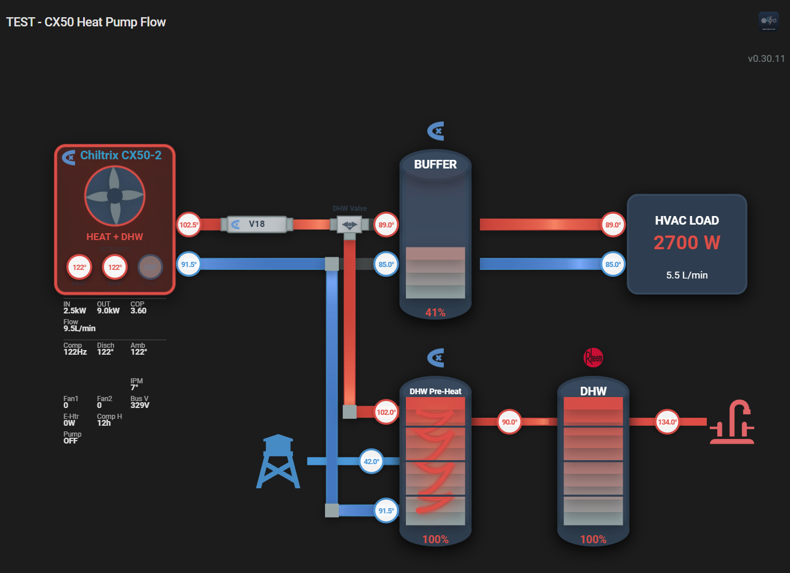

# Heat Pump Flow Card

A beautiful, animated Home Assistant card that visualizes heat pump water flow between the heat pump, buffer tank, and HVAC load with real-time temperature-based color gradients and dynamic flow animations.



## Features

✨ **Animated Water Flow** - Dots move along pipes at speeds proportional to actual flow rates

🌡️ **Temperature-Based Colors** - Pipes change color from blue (cold) to red (hot) based on actual water temperature

📊 **Real-Time Data** - Shows thermal power, COP, temperatures, and flow rates from your heat pump system

⚙️ **Highly Configurable** - Customize colors, animation speeds, temperature ranges, and display options

🏠 **HACS Compatible** - Easy installation through Home Assistant Community Store

## Installation

### HACS (Recommended)

1. Open HACS in your Home Assistant instance
2. Click on "Frontend"
3. Click the "+" button
4. Search for "Heat Pump Flow Card"
5. Click "Install"
6. Restart Home Assistant

### Manual Installation

1. Download `heat-pump-flow-card.js` from the [latest release](https://github.com/YOUR_USERNAME/heat-pump-flow-card/releases)
2. Copy it to your `config/www` folder
3. Add the resource to your Lovelace dashboard:

```yaml
resources:
  - url: /local/heat-pump-flow-card.js
    type: module
```

## Configuration

### Basic Example

```yaml
type: custom:heat-pump-flow-card
title: Heat Pump System
heat_pump:
  power_entity: sensor.heat_pump_electrical_power_input
  thermal_entity: sensor.heat_pump_thermal_power_output
  cop_entity: sensor.heat_pump_cop
  outlet_temp_entity: sensor.heat_pump_outlet_temperature
  inlet_temp_entity: sensor.heat_pump_inlet_temperature
  flow_rate_entity: sensor.cx50_pump_flow_lpm
buffer_tank:
  supply_temp_entity: sensor.hvac_buffer_tank_supply_temperature
  return_temp_entity: sensor.hvac_buffer_tank_return_temperature
hvac:
  thermal_entity: sensor.hvac_thermal_power_used
  flow_rate_entity: sensor.hydronic_flow_flow_rate
  supply_temp_entity: sensor.hvac_buffer_tank_supply_temperature
  return_temp_entity: sensor.hvac_buffer_tank_return_temperature
```

### Full Configuration Example

```yaml
type: custom:heat-pump-flow-card
title: Heat Pump Flow Visualization

heat_pump:
  power_entity: sensor.heat_pump_electrical_power_input
  thermal_entity: sensor.heat_pump_thermal_power_output
  cop_entity: sensor.heat_pump_cop
  outlet_temp_entity: sensor.heat_pump_outlet_temperature
  inlet_temp_entity: sensor.heat_pump_inlet_temperature
  flow_rate_entity: sensor.cx50_pump_flow_lpm
  name: "CX50 Heat Pump"
  icon: mdi:heat-pump

buffer_tank:
  supply_temp_entity: sensor.hvac_buffer_tank_supply_temperature
  return_temp_entity: sensor.hvac_buffer_tank_return_temperature
  level_entity: sensor.buffer_tank_level
  name: "Buffer Tank"
  icon: mdi:water-boiler

hvac:
  thermal_entity: sensor.hvac_thermal_power_used
  flow_rate_entity: sensor.hydronic_flow_flow_rate
  supply_temp_entity: sensor.hvac_buffer_tank_supply_temperature
  return_temp_entity: sensor.hvac_buffer_tank_return_temperature
  name: "Radiant Floor"
  icon: mdi:floor-plan

animation:
  min_flow_rate: 1    # Fastest animation (seconds for dot to travel)
  max_flow_rate: 5    # Slowest animation (seconds)
  dot_size: 8         # Size of animated dots
  dot_spacing: 30     # Spacing between dots

temperature:
  min_temp: 0         # Minimum temperature for color scale
  max_temp: 100       # Maximum temperature for color scale
  cold_color: "#0066FF"  # Color for coldest temperature (blue)
  hot_color: "#FF3300"   # Color for hottest temperature (red)
  unit: "C"           # "C" or "F"

display:
  show_values: true
  show_labels: true
  show_icons: true
  compact: false
  decimal_places: 1
```

## Configuration Options

### Main Options

| Name | Type | Default | Description |
|------|------|---------|-------------|
| `type` | string | **Required** | Must be `custom:heat-pump-flow-card` |
| `title` | string | Optional | Card title |

### Heat Pump Options (`heat_pump`)

| Name | Type | Description |
|------|------|-------------|
| `power_entity` | string | Electrical power input sensor (W) |
| `thermal_entity` | string | Thermal power output sensor (W) |
| `cop_entity` | string | COP (Coefficient of Performance) sensor |
| `outlet_temp_entity` | string | Heat pump outlet temperature sensor |
| `inlet_temp_entity` | string | Heat pump inlet (return) temperature sensor |
| `flow_rate_entity` | string | Water flow rate sensor (L/min) |
| `name` | string | Custom name for heat pump |
| `icon` | string | Custom icon for heat pump |

### Buffer Tank Options (`buffer_tank`)

| Name | Type | Description |
|------|------|-------------|
| `supply_temp_entity` | string | Buffer tank supply (hot) temperature |
| `return_temp_entity` | string | Buffer tank return (cold) temperature |
| `level_entity` | string | Tank level sensor (optional) |
| `name` | string | Custom name for buffer tank |
| `icon` | string | Custom icon for buffer tank |

### HVAC Options (`hvac`)

| Name | Type | Description |
|------|------|-------------|
| `thermal_entity` | string | Thermal power consumed by HVAC (W) |
| `flow_rate_entity` | string | HVAC flow rate sensor (L/min) |
| `supply_temp_entity` | string | HVAC supply temperature |
| `return_temp_entity` | string | HVAC return temperature |
| `name` | string | Custom name for HVAC |
| `icon` | string | Custom icon for HVAC |

### Animation Options (`animation`)

| Name | Type | Default | Description |
|------|------|---------|-------------|
| `min_flow_rate` | number | 1 | Fastest animation speed (seconds) |
| `max_flow_rate` | number | 5 | Slowest animation speed (seconds) |
| `dot_size` | number | 8 | Size of animated dots (pixels) |
| `dot_spacing` | number | 30 | Spacing between dots |

### Temperature Options (`temperature`)

| Name | Type | Default | Description |
|------|------|---------|-------------|
| `min_temp` | number | 0 | Minimum temperature for color scale |
| `max_temp` | number | 100 | Maximum temperature for color scale |
| `cold_color` | string | #0066FF | Hex color for minimum temperature |
| `hot_color` | string | #FF3300 | Hex color for maximum temperature |
| `unit` | string | C | Temperature unit: "C" or "F" |

### Display Options (`display`)

| Name | Type | Default | Description |
|------|------|---------|-------------|
| `show_values` | boolean | true | Show numeric values |
| `show_labels` | boolean | true | Show entity labels |
| `show_icons` | boolean | true | Show entity icons |
| `compact` | boolean | false | Compact layout mode |
| `decimal_places` | number | 1 | Decimal places for values |

## How It Works

The card visualizes your heat pump system in real-time:

1. **Heat Pump** (left) - Shows electrical power input, thermal output, and COP
2. **Buffer Tank** (center) - Stores heated water, decoupling the two flow loops
3. **HVAC Load** (right) - Shows thermal power consumed by radiant floors or other heating

**Animated Flow:**
- Dots move along pipes to show water flowing
- Speed is proportional to actual flow rate from sensors
- Pipe colors change based on water temperature (blue = cold, red = hot)
- Color intensity adjusts automatically to your temperature range

## Example: CX50 Heat Pump with Radiant Floor

Perfect for systems like the Chiltrix CX50-2 with:
- Heat pump → Buffer tank (primary loop)
- Buffer tank → Radiant floor (secondary loop)
- Separate flow sensors for each loop
- Temperature sensors at all connection points

## Troubleshooting

**Card not showing up**
- Make sure you've added the resource to your Lovelace configuration
- Try clearing your browser cache (Ctrl+F5)
- Check browser console for errors (F12)

**Animations not moving**
- Check that flow rate sensors are providing valid data
- Verify entities exist in Developer Tools → States
- Flow rate must be > 0 for animation to run

**Colors not changing**
- Verify temperature sensors are configured
- Check that min_temp and max_temp match your system's range
- Temperature entities must be in numeric format

## Support

For issues, feature requests, or questions:
- [Open an issue on GitHub](https://github.com/YOUR_USERNAME/heat-pump-flow-card/issues)
- [Home Assistant Community Forum](https://community.home-assistant.io/)

## Credits

Inspired by:
- [Sunsynk Power Flow Card](https://github.com/slipx06/sunsynk-power-flow-card)
- [Power Flow Card Plus](https://github.com/flixlix/power-flow-card-plus)

## License

MIT License - see LICENSE file for details
